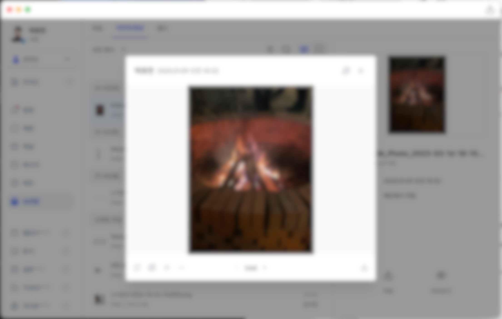
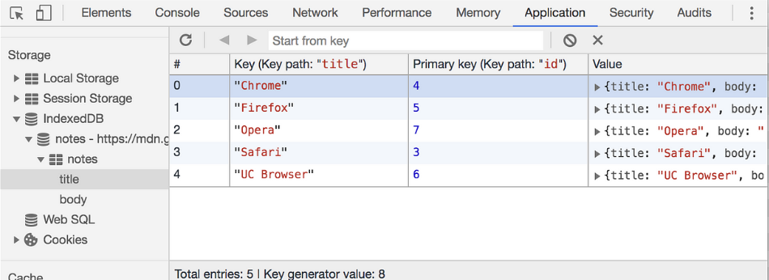

## 프로젝트를 시작하게 된 계기 (1)

저는 현재 회사 메신저 개발팀에서 개발하고있습니다.
짧게 소개하자면 B2B(Business-to-Business) SaaS(Software as a Service)를 제공하는 회사로 메신저서비스는 그 중 일부분의 서비스입니다.

메신저 개발을 2년여간 하면서 느낀 점은
`"메신저는 완벽해야 된다."` 입니다.

비교대상(KakaoTalk, Slack, MatterMost)이 워낙 압도적으로 시장을 선점하고 있기도 하고, 현대시대에서 메신저는 유료결제없이 손쉽게 접근해 사용할 수 있기 때문입니다.

완벽해야 되는 이유는 한가지 더 있습니다.
우리나라 사람들은 다른건 용납해도 인터넷이 느린건 용납이 안됩니다.
같은 맥락으로 인터넷상에서 메신저는 소통하고 대화함에 전부인데, 이게 답답하고 불편하다면 아무도 사용하지 않겠죠

이러함에 다시한번 저희 메신저를 업그레이드 하게 되었습니다.
Windows, Macos, ios, Android, Web으로 나눠져있던 메신저 에이전트를 최적화 하기위해

Windows, Macos와 Web을 통합해 WebApp으로 만들었고,
Windows와 Macos를 Electron을 사용해 Web 버전으로 만들어두었던 메신저를
데스트롭용 앱으로 만들자는게 첫번째 업그레이드였습니다.

기존에는 어떤 단점이 있었을까요?

첫번째로 기존에는 `에이전트 별로 개발물과 기획이 조금씩 상이`했습니다.
각 os마다 개발언어,기획, 개발환경에 따라 결과물이 오묘하게 달랐거든요.

사용자에게는 한가지 앱으로 보여지는 메신저가 회사에선 맥북으로 메신저를 설치하고 집에서는 그램으로 설치해 사용하던 사용자 A에게는 미묘하게 다른 반응속도, UI배치, 초기 메신저에 자주 등장하는 이슈들이 불편하게 느껴졌다고 합니다.

두번째는 `이슈개선과 기능추가시 시간이 너무 오래걸린다`였습니다.
각 에이전트 이슈가 다르게 나타났고 새로운 기능추가시 진행되는 속도와 공수가
달랐습니다.

이러한 이유로 WebApp으로 Windows와 Mocos를 Web버전으로 통합하게 되었습니다.

## 프로젝트를 시작하게 된 계기 (2)

서두가 길었습니다.

새 창에게 데이터 전달하게 된 계기는 Web에서 사용하는 모든 팝업을

팝업 메뉴를 새 창으로 띄워야 하기 때문입니다.

기존 브라우저의 구성을 보게되면 팝업창이 우리가 사용하는 페이지를 가리면서
나오게 되는 구조입니다.

브라우저에서는 이러한 방식이 불편하지 않습니다. 수많은 탭들로 여러웹페이지를 볼 수 있는데, 이 페이지마다 팝업을 새 창으로 보게된다면
굉장히 혼란스러울것입니다.

팝업을 사용하는 동안에 다른 기능을 사용하지 못한다면 메신저 앱의 기능특성상
불편한 점이 많습니다.


<span class="img-description">_(WebApp에서 웹처럼 팝업을 띄우면 닫기 전까지 다른 기능을 사용할 수 없다.)_</span>

예를들어, 메시지를 작성하고싶은데 이전에 거래처에서 메시지로 보내준 내용을 참고하며 작성해야하는 경우라면, 메인 앱에서는 메시지를 열어놓고

새 메시지를 작성해야하지만, 실제로 브라우저에서 보여주는 팝업구조라면 어렵겠죠?

회사 조직도 트리 UI를 참고하면서 채팅을 작성해야하는 경우라면,
조직도를 열고 직급,직책 등을 외운다음 채팅을 작성해야하는 수고스러움이 따릅니다.

이러한 이유들로 `새 창 프로젝트`를 진행하게 되었습니다.

## 준비

생각보다 고민해야 될 점이 많았습니다.

1. 새 창은 Electron과 연관되어있다. (Electron 추가개발이 필요함)

2. 새 창은 독립 개체이기 때문에 상태관리(recoil, zustand)와 state(변수) 공유가 안됩니다.

3. 이미 떠 있는 새 창은 새로 띄우지 말고 Focus 이벤트로 중복방지해야합니다.

4. 기존 팝업은 살려야합니다. (Web에서는 그대로 사용해야하기 때문에)

5. 웹소켓을 새 창에게 전달해야합니다.

새 창은 메신저를 기준으로 글 쓰기,수정,삭제 창, 채팅방, 조직도, 파일보관함 등이 예정되어있었고 5개의 고려사항이 모두 일치하는 메뉴들이었습니다.

이번에 공유할 내용은 2번에 해당되는 `메인 앱에서 새 창으로 데이터 보내기` 입니다.

## 데이터를 공유하는 방법

`1. localStorage, sessionStorage`

`2. window.postMessage`

`3. broadcastChannel`

`4. Query Parameter`

`5. IndexedDB`

시행착오를 거쳤던 5가지 방법입니다.

결과적으로는 3, 4번 방법으로 데이터 공유를 하게되었습니다.

왜 그렇게 선택했는지 나눠보겠습니다.

### localStorage, sessionStorage (부적합)

제 기준으로 가장 접근성이 좋고 코드가 간결한 storage입니다.

새 창을 열고 데이터를 전달한다고 가정했을때

```javascript
// 메인 앱
const sendNewWindowData = () => {
  localStorage.setItem("item-1", JSON.stringify(data))
}
// 새 창 열기 버튼 클릭
sendNewWindowData()

// 새 창
useEffect(() => {
  const fowardingData = localStorage.getItem("item-1")
  setData(() => {
    localStorage.removeItem("item-1")
    return JSON.parse(fowardingData)
  })
}, [])
```

간단하게 구현하면 이렇게 전달 할 수 있겠네요.

storage는 동기적으로 작동하고 React의 상태관리와 연결되지 않기에
state로 복사해 저장한 뒤 지워야합니다.

#### 사용하기 어려운 이유

**용량 제한**

우선 storage는 용량 제한이 있습니다.

브라우저마다 상이하지만 5~10MB의 용량제한이 있고, 이 이상의 데이터를
저장 할 경우 초과되는 데이터는 저장되지 않습니다.

**동기적인 동작**

localStorage는 동기적으로 작동하므로, 데이터를 읽거나 쓸 때 메인 스레드가 차단됩니다.
큰 데이터를 빈번히 읽거나 쓰면 UI 렌더링과 사용자 경험에 영향을 줄 수 있습니다.

**탭 간 데이터 충돌**

storage는 여러 탭에서 공유됩니다. 공유되기 때문에 새 창으로 데이터 전달이 가능하지만, 저장시점이 겹치거나 동시에 접근하는 경우 데이터 충돌이 일어날 수 있습니다.

실제로 데이터 교류가 자연스럽게 가능했습니다.
그러나 품질관리측면에서 보았을때 용량 제한과 데이터 충돌의 리스크가 컸습니다.

실제로도 복잡한 데이터 교류나 딜레이로 인해 사용자가 이벤트를 거의 동시에 실행하는 등 특정상황에서 데이터 충돌이 일어나는 것을 발견했습니다.

### IndexedDB (부적합)

브라우저 내부에 내장된 비동기 데이터베이스입니다.


<span class="img-description">_(브라우저 검사하기에서 확인할 수 있다.)_</span>

IndexedDB는 상대적으로 적은양의 데이터를 저장할 수 있는 Web Storage를 보완하면서 key,value 형식을 담아 많은 양의 데이터를 저장할 수 있습니다.

데이터를 전달하기에 왜 적절치 않을까요? localStorage의 용량문제도 개선되고
새 창에서도 접근가능하니 데이터 전달이 불가능하진 않습니다.

#### 사용하기 어려운 이유

그러나 사용되는 메커니즘 자체가 구조화된 많은 양의 데이터를 저장하고 가져오는것이 다 보니 패턴이 까다롭습니다.

`1. 데이터베이스 열기`<br/>
`2. 데이터베이스에 객체 저장소(Object store) 생성하기`<br/>
`3. 트랜젝션(Transaction) 시작하기 (데이터 읽기, 쓰기 제거 등 데이터베이스 작업 요청)`<br/>
`4. 이벤트 리스너를 사용하여 요청이 완료될때까지 기다리기`<br/>
`5. 요청 결과를 가지고 어떤 동작하기`

Web Storage에 비해 상대적으로 사용하기 복잡합니다.<br/>
간결하고 반복적으로 데이터 통신이 필요한 지금 상황에 맞지 않다고 판단했습니다.

### window.postMessage (부적합)

`window.postMessage`는 설득력있는 데이터 전송 방식입니다.

상황에 따라서 메인앱에서 새 창으로 데이터 전송하기도 가능합니다.

```javascript
// 보내기 (메인 앱)
const popup = window.open(
  "http://localhost:3000/popup",
  "myPopup",
  "width=600,height=400"
)

if (popup) {
  // 팝업 창에 메시지 보내기
  popup.postMessage("사과는 빨갛다.", "http://localhost:3000")

  // 팝업에서 메시지 받기
  window.addEventListener("message", event => {
    if (event.origin !== "http://localhost:3000") return // 보안 검증

    // 새 창에게 받은 메시지 : 바나나는 노랗다.
    console.log("새 창에게 받은 메시지 :", event.data)
  })
}

// 받기 (새 창)
window.addEventListener("message", event => {
  if (event.origin !== "http://localhost:3000") return // 보안 검증

  // 부모 창에게 받은 메시지 : 사과는 빨갛다.
  console.log("부모 창에게 받은 메시지 : ", event.data)

  // 부모 창에 응답 보내기
  event.source.postMessage("바나나는 노랗다.", event.origin)
})
```

#### 사용하기 어려운 이유

하지만 제가 사용하기 적합하지 못한 부분이 있습니다.

`1. 받는 대상을 항상 참조해야한다.`

내가 보낼 메시지를 받을 새 창을 항상 참조해야합니다.
새 창은 하나만 사용되지 않습니다.
새 창의 목적은 사용자의 편의성을 위함이기 때문에 사용자는 메시지를 작성하는 새 창을 띄워놓고 조직도를 보여주는 새 창을 동시에 바라볼 수 있고, 때에 따라
중복되거나 다수의 새 창을 사용해야할 상황이 있습니다.

매번 받는 대상을 참조해 메시지를 보낸다면 제한적인 상황이 나올 가능성이 높습니다.

`2. 한번에 한 개의 새 창에만 메시지를 보낼 수 있다.`

참조한 대상에게 한번만 메시지를 보낼 수 있습니다.
중복 열기가 가능한 새 창에서는 새 창을 갯수만큼 보내야되는데,
이 때 열려있는 새 창의 갯수를 파악하기 어렵고, 구현하려는 기능에
비효율적입니다.

### broadcastChannel (적합)

**broadcast** 말그대로 (창, 탭, 프레임 또는 iframe)에게 보낼 내용을 전파할 수 있습니다.

`broadcastChannel`을 구독해둔 모든 새 창은 `onmessage` 리스너로 전달 받은 정보를 그대로 저장하거나 가공한 뒤 저장할 수 있습니다.

기본적으로 `window.postMessage`과 사용법은 유사합니다.

```javascript
// 메인 창

// 채널 생성
const broadcast = new BroadcastChannel("new_window_channel")
// 메시지 전파
broadcast.postMessage({
  type: "data-message",
  message: "hello",
})

// 새 창

// 채널 구독
const broadcast = new BroadcastChannel("new_window_channel")
// 리스너
broadcast.onmessage = event => {
  const { type, message } = event
  if (type === "data-message") {
    console.log("받은 메시지 :", message)
  }
}
```

각 새 창마다 채널을 구독해두고 리스너로 원하는 내용을 캐치에서 사용한다면,
거의 모든 경우에 알맞게 데이터를 보내고 수신할 수 있습니다.

### Query Parameter (적합)

새 창을 열 때 `window.open()`에 담아 보낼 쿼리 파라미터에도
데이터를 담아 보낼 수 있습니다.

`window.postMessage()`와 `broadcastChannel`은 데이터 통신이 가능하지만
비동기처리로 전송됩니다.

사용자가 새 창을 `window.open()`으로 열어도 사실 새 창은 바로 열리지 않습니다.

서버에서 받은 페이지 정보를 렌더링해 그리는데까지 딜레이가 존재합니다.

`window.open()`과 동시에 `window.postMessage()`와 `broadcastChannel`으로
데이터를 전송한다면 이미 메시지 리스너가 생기기도 전에 메시지는 사라져있겠죠?

이 점을 간과했기때문에 왜 postMessage를 받지 못하는지 한참을 헤맸었습니다.

```javascript
// 예시
window.open("https://example.com/page?key1=value1&key2=value2")
```

쿼리 파라미터에 담은 데이터를 새 창에서 받습니다.
그러나 파라미터에 담을 수 있는 최대 용량이 정해져 있습니다.

`Internet Explorer: 최대 2,083자`<br/>
`Chrome 및 Firefox: 최대 약 32,767자`<br/>
`Safari 및 Opera: 약 8,000자`

당연히 실제 새 창에서 보여줄 데이터를 전송하기엔 애매한 부분입니다.
가령 사용자의 메시지 목록을 보여줄 새 창이라면 사용자의 메시지가 많을 수록
보내야할 데이터량도 비례할 것 입니다.

그렇기에 초기에 API요청에 필요한 파라미터를 전달하는 용도로만 사용했습니다.

## 실제 적용한 방법

`Query Parameter`와 `broadcastChannel`을 통해 데이터 전송을 구현했습니다.

새 창이 처음 열릴 때 `Query Parameter`로 API요청에 사용될 id를 전달했고,
API요청으로 받은 데이터를 보여줬습니다.

사용자가 메인에서 발생시키는 이벤트를 `broadcastChannel`을 통해 열려 있는
새 창에 전달해 동적으로 작동되게 설계했습니다.

`broadcastChannel`으로 메인 앱에서 전달받는 웹소켓데이터도 전달해
새 창에서는 선택한 타겟에 맞는 API요청으로 받아온 데이터를 보여줌과 동시에
사용자의 이벤트와 웹소켓 데이터를 전달받아 보여줄 수 있게 되었습니다.

**열릴 때 API요청을 했다면, 사용할 모든 데이터를 API요청 해도되는거 아니야?**

모든 경우에 해당되진 않지만, 불가능한 방법은 아닙니다.
그러나 새 창을 열 때마다 모든 데이터를 불러온다면 서버 부하를 증가하고,
이는 전체적인 성능 저하로 이어질 수 있습니다.

추가하고자하는 기능구현에만 집중한다면 추후에 전체적인 서비스 성능저하로 이어질 수 있습니다.

## 후기

제 기준에서는 흔하지 않은 경험이었습니다.

초기에는 `localStorage`만으로 전달하는 로직을 만들었었습니다.

실제로 이벤트리스너 `storage`를 사용하면 추가/수정/삭제 시 변경감지가 가능했고,<br/> 테스트버전으로 구현했을 당시 퍼포먼스에는 큰 차이가 없었습니다.

그러나 현재 사용중인 다른 `localStorage` 와 맥락이 일치하지않았고,
여러 문제(저장용량 제한)등으로 보완하게 되었습니다.

또 이번에 부적합했던 방법들도 저의 경우와 맞지 않았을 뿐
상황에 따라 더 알맞게 사용한다면 더 좋은 결과물로 이어질 수 있다고 생각합니다.
