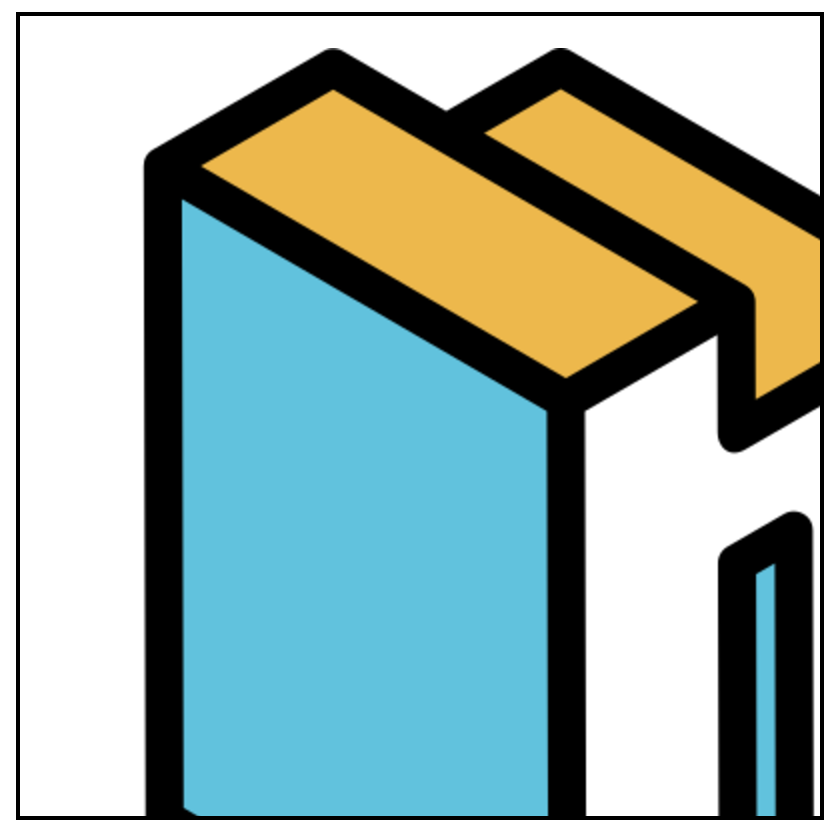

## 일반적인 이미지 크기 설정

일반적으로 UI를 개발할 때 원하는 영역에 이미지를 넣고 크기를 조절합니다.

이미지를 원본 크기 그대로 설정한다면 크고 작은 이미지들로 인해 UI가 울퉁불퉁해집니다.

```javascript
// 원본 이미지 크기

```

이미지 크기는 제각각 이기 때문에 고정 너비, 높이를 주면 `원본 비율`이 유지되기 어렵습니다.

```javascript
// 너비, 높이 고정

```

내가 사용할 모든 이미지를 위와 같이 너비, 높이를 고정해둔다면 매번 같은
이미지 크기와 비율을 신경써야합니다.

물론 이미지 왜곡을 피할 수 있는 방법이 있습니다.

```javascript
// object-fit : cover, contain


// 너비 고정, 높이 auto

```

`object-fit : cover` 또는 `object-fit : contain` 또는 높이값을 `auto`또는 때에 따라 `100%`로 설정 할 수도 있겠네요.

## 또다른 방법

대부분의 경우 `object-fit : cover` 또는 `object-fit : contain`로 커버가 될 것입니다.

그런데 css 속성은 특정조건에 커스텀이 어렵습니다.<br/> 이미지 처리를 할때는
반응형과 확대,축소도 고려사항입니다.

그래서 직접 비율을 구해 너비와 높이를 설정해보겠습니다.

### 비율 구하기

컨테이너 박스보다 이미지가 크다면 어떻게 될까요?


<span class="img-description">_(원본 이미지 사이즈보다 UI영역의 크기가 작아 스크롤이 생기고 있다.)_</span>

이미지 원본 사이즈를 컨테이너 박스의 비율에 맞게 다시 계산해 설정하면 어떨까요?

```javascript
let imageWidth
let imageHeight
// 비율 계산 후 리사이징
const imageElement = document.getElementById("image")
const containerElement = document.getElementById("container")

const handleImageLoad = () => {
  const imgWidth = imageElement.offsetWidth
  const imgHeight = imageElement.offsetHeight
  const ctWidth = containerElement.offsetWidth
  const ctHeight = containerElement.offsetHeight

  const scale = Math.min(ctWidth / width, ctHeight / height)

  imageWidth = width * scale
  imageHeight = height * scale
}

if (imageElement.complete) {
  handleImageLoad()
} else {
  imageElement.onload = handleImageLoad
}
```

이미지가 로드 된 이후에 이미지를 감싸고 있는 컨테이너 박스와 이미지의 너비, 높이를 가져와 계산합니다.

비율(scale)을 구할 때는 컨테이너 (너비, 높이)/ 이미지 (너비, 높이)를 해야하는데 두 몫중에 작은값을 scale로 사용합니다.

작은 값을 scale로 사용하는 이유는 가로나 세로만을 기준으로 비율을 정한다면
가로가 길거나 세로가 긴 특정 이미지들의 비율이 왜곡 될 수 있기 때문입니다.

`비율(scale) = Math.min(컨테이너 너비/이미지 너비, 컨테이너 높이/이미지 높이)`<br/>
`계산 된 너비 : 이미지 너비 * 비율(scale)`<br/>
`계산 된 높이 : 이미지 높이 * 비율(scale)`


<span class="img-description">_(원본이 컨테이너 박스보다 크지만 크기 조절이되었다.)_</span>

## object-fit과 다른 점이 뭐야?

`object-fit:cover` 속성도 가로, 세로 비율을 유지해주긴 합니다.
그러나 `object-fit:cover` 의 목적은 컨테이너 박스의 크기를 완전히 채우는것입니다.

그렇기 때문에 컨테이너와 이미지의 비율이 다를 때 이미지가 잘릴 수 밖에 없습니다.

`object-fit:contain`과는 유사합니다. 이미지의 비율이 달라도 잘리지 않고
비율을 계산해 비율이 맞지 않는 부분이 여백으로 처리됩니다.

`scale`을 계산해서 사용하는 방식과의 차이점은 `scale`을 계산해 이미지 처리를 한뒤 남는 여백을 추가 로직으로 채울 수 있습니다.

또다른 차이점은 `반응형`입니다. 화면을 크게 늘렸을 때 `object-fit:contain`은
화면의 크기에 맞게 이미지가 늘어납니다.

`scale`을 계산한 로직을 커스텀마이징한다면, `반응형`에서 컨테이너 크기를 따라가지 않고 유연하게 처리할 수 있습니다.

## 요약

영역안에 이미지를 가득 채우고 싶다. = `object-fit:cover`

비율을 유지하면서 영역안에 이미지를 가득 채우고 싶다. = `object-fit:contain`

비율을 유지하고 반응형과 확대/축소에 유연하게 처리하고싶다. `scale 계산`
