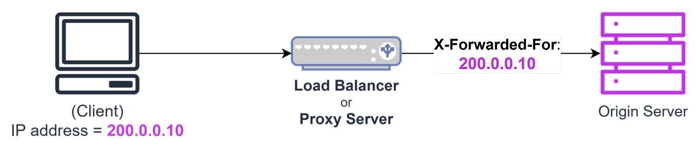

## IP란?

IP는 인터넷에서 각 기기들을 구분하기 위한 `주소`입니다.
크게 두가지로 분류할 수 있는데, 공인 아이피(Public IP)와
사설 아이피(Private IP)입니다.

이번 프로젝트에 추가된 기능은 `IP 허용대역 설정`인데
이 기능은 Admin에서 특정 IP에 대한 허용대역을 설정한뒤
허용대역에 포함되거나 포함되지 않는 사용자를 식별한 후
서비스에서 처리하기 위해 기획되었습니다.

### IP 허용대역 설정하기

기본적인 구현 로직을 정리하자면

`1. Admin에서 IP허용대역 설정 후 적용`<br/>
`2. 서버에서 해당 IP허용대역을 저장하고 클라이언트에 웹소켓으로 전달`<br/>
`3. 클라이언트는 전달받은 웹소켓으로 Alert노출 후 로그아웃 처리`<br/>
`4. 재로그인 시도시 423 error로 차단`<br/>

전반적으로 Admin에서 많이 사용되는 정책기능들과 유사합니다.<br/>
기능구현중에 기억에 남는 것들이 있습니다.

### IP 구성

IP는 일반적으로 IPv4 주소이고, 보통 4개의 숫자(옥텟, octet)로 이루어져 있습니다.
각 자리(옥텟)는 네트워크와 호스트를 구분하는 데 사용되는데,
첫번째와 두번째위치의 주소는 네트워크 식별자 세번째는 서브넷 or 호스트 일부이고 네번째는 호스트 식별자를 나타냅니다.

```typescript
192.160.1.10

// 192 네트워크 식별자
// 160 네트워크 식별자
// 1 서브넷 or 호스트 일부
// 10 호스트 식별자
```

그러나 정확한 역할은 `서브넷 마스크`에 따라 바뀔수있는데,<br/>
`서브넷 마스크`는 어디까지가 네트워크이고
어디부터가 호스트(컴퓨터) 인지를 알려주는 값입니다.

가장 일반적으로 많이 사용되는 `서브넷 마스크`는
`255.255.255.0` 마지막 자리가 호스트를 가리키는데,

사용자는 허용아이피 대역을 지정하기 위해 <br/>
`192.160.1.10-192.160.1.20` 처럼 설정하고 싶은 범위를
지정할 수 있게 개발했습니다.

#### 참고

이때 192.160.1.0은 네트워크 자체를 나타내고<Br/>
192.160.1.255는 모든 컴퓨터에게 보내는 브로드캐스트 주소를
의미하기에 제외합니다.

### 왜 Docker에서 띄운 서버는 공인IP를 알지 못할까?

초기에 내 공인아이피 조회 (`https://api.ip.pe.kr/json/`)로 응답받은 IP와
서버가 알고있는 내 IP의 주소가 달라서 의문점을 가졌었습니다.

서버는 Docker에서 띄운 로컬서버였는데 Docker는 호스트 내부의 가상 네트워크안에서 실행되기때문에,
사설 IP만 사용하고 공인 IP는 직접 가질 수 없음을 알았습니다.

Docker 컨테이너안에서 IP를 찾아봐도 컨테이너 바깥의 호스트가 IP를 갖고있기때문에
컨테이너에 호스트 IP를 알려주거나 바깥에서 확인하는 방법밖엔 없습니다.

### 로컬환경에서 테스트해보기

Admin에서 IP 허용대역을 적용하고, 서버는 웹소켓으로 클라이언트에게 IP허용대역을 알려줍니다.
정리하자면 아까 IP허용대역 설정한대로 잘 차단이 되는지 확인해야합니다.
IP 허용대역에 내 IP가 포함되지 않는다면 서버는 에러로 응답하게 됩니다.

근데 내 IP만으로 테스트하자니, 케이스가 적어 고민이었습니다.
이 과정속에서 `X-forwarded-for`로 클라이언트 요청시에 원하는 ip를 서버에게 알려줄 수 있음을 알게되었습니다.


<span class="img-description">_(X-forwarded-for의 흐름)_</span>

`X-forwarded-for`는 서버에게 내 IP를 알려주기 위한 신호인데, 왜 굳이 직접 알려줘야하냐면
요청후 로드밸런스나 프록시를 중간에 거치게될때 서버는 방금거쳐간 로드밸런스, 프록시의 IP를 바라보기때문에
실제 사용자의 IP를 알 수 없습니다.

그러나 보안상의 이유로 테스트환경을 제외하곤 사용이 지양되기 때문에, 로컬환경에서 보안설정을 해제해둔 상태로
테스트했습니다.

### 마무리

IP허용대역 설정에 대한 기능말고도 클라이언트에서 어떻게 처리할지 고민해야합니다.
차단된 IP에 대한 내용을 웹소켓 또는 정책조회 API 응답으로 처리할 수 있겠네요.

사실 IP관련된 기능개발이 처음이라 기초적인 개념부터 짚고 넘어가느라 시간이 더 걸린것같습니다.
IP에 대한 내용은 이번 포스팅으로 다 정리하기엔 너무 방대해서 IP와 관련된 또다른 기능구현이나
새롭게 알게된 내용이 있다면 추가로 정리해보겠습니다.
