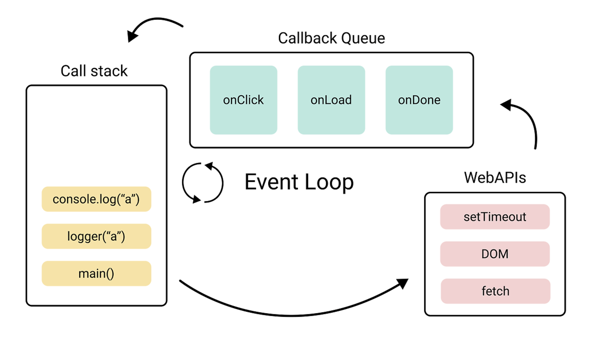

## 비동기처리는 어려워

JS를 공부할 때 가장 처음에 마주하는 동기/비동기에 대해 들어보셨나요?<br/>

자바스크립트는 싱글스 레드 언어라고 하는데, 도대체 한 번에 하나씩 일할 수 있는
우리의 자바스크립트 엔진은 어떻게 동기/비동기 처리를 아름답게 해낼까요?<br/>

바로 든든한 브라우저라는 친구가 비동기 처리를 대신해주기 때문입니다.

## 상황극 (JS와 브라우저)

비동기, 이벤트 루프, 콜 스택, 콜백 큐, 웹 APIs...

설명하는 글이 수도 없이 많지만, 이해하기 전까지는 볼 때마다 새로운 단어입니다.
Gpt와 놀던 중 상황극을 한번 부여해 봤습니다. 이해하기 편하게요

### 소개

`1. Call Stack - 요리사`<br/>
`2. Web APIs (브라우저) - 주방의 외주업체`<br/>
`3. Callback Queue - 대기 중인 음식`<br/>
`4. Event Loop - 가게 매니저`<br/>
`5. Job (해야할 작업, 요청) - 손님의 주문`<br/>
`6. Async Job(비동기 작업, 요청) - 손님의 특별한 주문`<br/>
`7. Call Stack 오버플로우 - 많은 일, 혼잡함`<br/>
`8. Microtask Queue - 급한 주문`<br/>
`9. Tick - 손님이 요청한 일이 더 남았는지 확인`<br/>

### 레스토랑의 하루

`손님의 주문`이 들어오고 메뉴를 주문합니다.
`요리사`는 주문한 메뉴를 준비합니다.

```javascript
console.log("여기 음식 나왔습니다 :)") // Call Stack에서 즉시 실행
```

`손님의 특별한 디저트 주문`이 들어왔습니다.<br/>
이 주문은 시간이 오래걸리고 효율적이지 못합니다.<br/>
`요리사`는 디저트 전문 `외주업체`에게 맡깁니다.

```javascript
setTimeout(() => {
  console.log("디저트 제작이 완료되었습니다.") // Callback Queue에 들어감
}, 3000)
```

디저트를 맡긴 뒤 `요리사`는 또다른 `손님의 주문`을 준비합니다.

```javascript
console.log("지금 음식을 준비중입니다.") // Call Stack에서 즉시 실행
```

```javascript
console.log("여기 다음 음식 나왔습니다!") // Call Stack에서 즉시 실행
```

`가게 매니저`가 디저트가 완료되었다는 소식을 듣습니다.<br/>
`요리사`가 빈손이 되고 준비된 디저트가 제공됩니다.

순서가 어떻게될까요?

`1`. 첫번째 음식전달<br/> `2`. 두번째 음식 준비 중... <br/>`3`. 두번째 음식 전달<br/> `4`. 디저트 완성 후 전달

### 번외 (특별한 상황)

주문이 너무 많고 `혼잡한 일`이 생겨버렸습니다.

```javascript
function cook() {
  // 재귀 함수 (loop)
  cook()
}
cook()
```

`가게 매니저`는 `급한(작은)주문`부터 우선적으로 처리합니다.

```javascript
Promise.resolve().then(() => console.log("여기 물 좀 주세요!")) // Microtask Queue에 들어감
```

`가게 매니저`가 `주문이 더 있는지` 확인합니다.

먼저 `급한 일`부터 확인합니다. `급한 일`이 다끝났거나 이제 없으면
`대기 중인 음식`이 있는지 확인합니다.

`가게 매니저`는 `주문이 더 있는지` 두 번 확인했네요.

```javascript
console.log("떡볶이 나왔습니다.") // Call Stack에서 즉시 실행

setTimeout(() => {
  console.log("디저트 나왔습니다.") // Callback Queue에 들어감
}, 0)

Promise.resolve().then(() => {
  console.log("흘리셨나요? 여기 티슈있습니다.") // Microtask Queue에 들어감
})

console.log("순대 나왔습니다..") // Call Stack에서 즉시 실행
```

## 마무리


<span class="img-description">_(이벤트 루프)_</span>

상황극 잘 보셨나요? 이 등장인물들과 배경요소를 실제 JS 작동 순서, 원리에
다시 대입해 보세요.<br/>

저는 개인적으로 생소하고 어려운 개념 공부일수록 쉽고 간단하게 다가가려 합니다.<br/>
결국엔 맞닥뜨려야 하는 실제 상황에서는 갈고닦아왔던 생각과 지식들을 펼쳐놓아야겠지만,<br/> 이 과정이 지루하고 답답하고 힘들다면 남는 것도 적다고 생각하는 편입니다.

결론은 이 레스토랑은 요리사가 요리하는 만큼 외주업체도 많이 사용한다는 뜻입니다.<br/>
비동기처리라고하면 보통 setTimeout으로만 예시를 많이 들곤하는데,
파일업로드, 실시간 데이터 업데이트(웹소켓), API요청 또한 비동기 처리로 많이 진행됩니다.<br/>

실제로는 외주업체를 많이많이 사용하고 있다는 뜻이지요.<br/>

매니저는 항상 이 일들을 고르게 분배해주고 조율을 잘하는 조율자이며,<br/>
우리는 손님의 입장이기때문에 이해되지 않는 동작순서를 마주하게된다면<br/>

급한주문(Microtask Queue)이 우선이라는 점을 한번 떠올려보고,<br/>
이전 작업이 마무리되고 다음 이벤트 루프 사이클로 넘어가는 시점(Tick)으로 <br/>넘어가지 않았는지 확인해보는 것도 좋은 방법이라고 생각합니다.<br/>

이해가 잘 안되는 부분이 생길 때 이렇게 일상생활에 상황극을 빗대어보면<br/>
가끔 마주하는 이론과 친해지지 않을까요?
