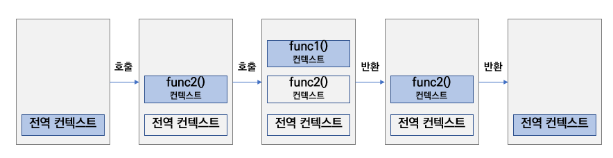

## 복습해볼까요.

`Hosting`<br/>
`Closure`<br/>
`실행 Context`<br/>
`Event Bubbling & Event Capture`<br/>
`Scope`<br/>
`This`<br/>
`Promise, async/await`<br/>
`Callback Function`<br/>

자바스크립트 공부를 하고 리액트로 개발하는 사람이라면
모를수가 없는 기본지식입니다.

호이스팅이 뭐야? 라고 물어본다면 누군가는 책에서 본 문장들을 줄줄 외울것이고,
누군가는 '아...아는데...'라고 망설입니다.

저것들을 명확하게 설명하기 어려운 이유는 사전적인 정의를 설명하자니
수학공식외우듯 말하게되고 조리있게 설명하자니 예시가 잘 떠오르지 않습니다.

### Hosting

자바스크립트는 코드 실행 전에 변수와 함수의 선언을 미리 메모리에 올려놓아 코드가 원활하게 실행되도록 하기때문에, 선언 되는 위치 이전에 호출하거나 사용해도 사용할 수 있게 됩니다.

자바스크립트 엔진이 코드가 실행되기 전에 해당 스코프의 최상단으로 끌어올려놨기 때문에 작성 순서에 상관없이 사용 할 수 있게 된겁니다.

오늘 저녁반찬으로 낙지볶음을 해야되는데, 낙지, 채소, 소금, 후추 등 재료들을 요리할 때마다 준비하면 시간이 낭비됩니다.

미리 재료를 테이블위에 모두 올려두고 요리를 실행하는 것과 유사합니다.

그런데 이상한 점이 있습니다.

var, let, comst로 변수선언하기전에 확인해보니 원하는 값이 찍히지 않습니다.

3가지 방법의 변수선언 모두 호이스팅 되었지만, 값이 보이지 않는 이유는

`var`

선언과 초기화 단계가 동시에 진행되며, 초기 값으로 undefined가 할당됩니다.

따라서 변수 선언 이전에 해당 변수에 접근하면 undefined를 반환합니다.

`let과 const`

선언 단계와 초기화 단계가 분리되어 진행됩니다.

선언은 호이스팅되지만, 초기화는 실제 코드에 도달했을 때 수행됩니다.

초기화 이전에 해당 변수에 접근하면 ReferenceError가 발생합니다.

**변수의 생성 단계**

`1.선언 단계`

변수를 실행 컨텍스트의 변수 객체에 등록한다.
이 변수 객체는 스코프가 참조하는 대상이 된다.

`2.초기화 단계`

변수 객체에 등록된 변수를 위한 공간을 메모리에 확보한다.
이 단계에서 변수는 undefined로 초기화 된다.

`3.할당 단계`

undefined로 초기화된 변수에 실제 값을 할당한다.

**정리**

결론적으로 호이스팅 덕분에 선언되기전에 사용하는건 좋은 습관이 아닙니다.
자바스크립트 엔진이 각 종 선언들을 메모리에 올려놓아 원활하게 실행되는게
이점이지 그로 인해 호이스팅된 변수와 함수들의 순서를 섞어 사용한다면,
가독성도 해치고 혼란이 찾아오게됩니다.

변수의 생성이 끝난 시점에 사용하는 습관을 가지는게 바람직합니다.

**`var` 보다 `let`과 `const`로 변수선언을 하는 이유**

그렇기 때문에 변수선언을 let과 const로 하는게 호이스팅으로 발생한 에러를
미연에 방지 할 수 있기때문에 좋습니다.

말 나온김에 var에서 let, const를 사용하는 이유를 짧게 말하자면

var는 전역 범위,함수 범위이고 let,const는 블록 범위 입니다.

이말이 뭐냐면

```javascript
var greeter = "hey hi"
var times = 4

if (times > 3) {
  var greeter = "say Hello instead"
}

console.log(greeter) // "say Hello instead"
```

var는 재선언이 가능합니다.
스코프가 전역이다보니 어디에서 선언을 하든 값이 바뀔 수 있습니다.

같은 js파일안에 실수로 같은이름의 변수를 사용하고 있었거나,
예상치 못하게 변수명이 맞물릴 경우 문제를 일으킬 수 있습니다.

블록 범위는 한마디로 {}(중괄호)까지 범위를 설정할 수 있다는 뜻입니다.

```javascript
let greeting = "say Hi"
let times = 4

if (times > 3) {
  let hello = "say Hello instead"
  console.log(hello) // "say Hello instead"
}
console.log(hello) // hello is not defined
```

이 예시와 같이 블록범위안에서 선언한 let변수는 그 안에서만 사용할 수 있습니다.
물론 글로벌하게 선언하면 어디서든 사용가능 하겠지만, 업데이트는 가능하나
재선언은 불가능합니다.

### Closure

클로저는 **함수가 선언될 당시의 환경(environment)을 기억했다가 나중에 호출 되었을 때 원래의 환경에 따라 수행되는 함수** 라고 정의합니다.

하지만 이렇게 설명하고 전문용어를 나열하면 이해하기전부터 답답합니다.

클로저는 금고와 열쇠로 비유할 수 있습니다.

```javascript
function safe(password) {
  return function openSafe(key) {
    if (password === key) {
      console.log("open")
    } else {
      console.log("lock")
    }
  }
}

// 진짜 열쇠
const realKey = safe(007)
// 가짜 열쇠
const fakeKey = safe(008)

console.log(realKey(007)) // open
console.log(fakeKey(007)) // lock
```

결과부터 볼까요? realKey나 fakeKey나 둘다 safe를 참조하고있는데 왜 열쇠비밀번호 007을 넣었을때 하나는 열리고 하나는 잠길까요?

우선 열쇠는 처음에 금고를 열 수 있는 비밀번호를 제공받습니다.

비밀번호는 보다시피 007이죠

그러나 가짜열쇠는 비밀번호를 정확히 모릅니다. 008를 제공받았죠

사용자는 금고 비밀번호를 알고있습니다. 하지만 이 금고는 이중보안입니다.

올바른 비밀번호를 가진 열쇠에 올바른 비밀번호를 입력해야 열리죠

realKey는 007을 fakeKey는 008을 기억하고있습니다.

**그래서요?**

클로저는 위에 설명한 위 상황을 이야기합니다.

함수A안에 함수B를 선언한 뒤 함수 B에 접근하기위해서는 함수A를 할당한 변수A를 통해서만 가능하다는 말입니다.

즉 내가 가진 key가 올바르지않으면 비밀번호를 알게되어도 조건식에 가로막혀
접근할 수 없습니다.

클로저 함수는 이 key를 통해서만 올바르게 접근 할 수 있습니다.

이 모든 과정이 끝나도 realKey는 비밀번호 007을 **클로저**로 기억하고있습니다.
나중에 또다시 로직을 실행할 때 realKey에게 비밀번호는 007이라는 사실을 알려 줄 필요가 없다는 뜻이죠

**언제 사용하면 좋을까요?**

`1. 데이터 보호(캡슐화)`

클로저를 사용하면 함수 내부의 변수를 외부에서 직접 접근하지 못하게 보호할 수 있습니다. 이를 통해 중요한 데이터가 외부 코드에 의해 실수로 변경되는 것을 막을 수 있습니다.

`2. 상태 유지`

클로저는 함수 호출이 끝난 후에도 변수를 기억합니다. 이를 통해 함수의 상태를 유지하거나 누적 데이터를 저장할 수 있습니다.

```javascript
function counter() {
  let count = 0 // 초기값

  return function increase() {
    count += 1
    return count
  }
}

const myCounter = counter()
console.log(myCounter()) // 1
console.log(myCounter()) // 2
console.log(myCounter()) // 3
```

**잘 못 쓰는 경우**

`1. 메모리 누수`

```javascript
function createHeavyTask() {
  const largeData = new Array(1000000).fill("데이터")

  return function () {
    console.log(largeData[0])
  }
}

const task = createHeavyTask()
// largeData는 여전히 메모리에 남아 있음
```

아까 사용해야하는 이유중에 상태 유지가 있었습니다.
이는 상황에 따라 메모리 누수로도 이어집니다.

많은데이터를 클로저로 처리하고 난 뒤에도 아직 데이터는 남아있습니다.

**클로저가 내용을 기억하는 원리**

클로저가 내용을 기억하는 원리는 함수가 선언될 때의 스코프에 대한 참조를 유지하기 때문입니다.

클로저가 내용을 기억하는 방식
함수의 선언 시점에 스코프가 함께 캡처됨
클로저는 함수가 선언될 때, 해당 함수가 위치한 스코프의 변수를 기억합니다. 이때 함수가 반환되더라도 해당 변수는 계속해서 메모리에 유지됩니다.

변수의 참조 유지
클로저 내부에서 사용되는 변수들은, 함수가 실행된 후에도 여전히 그 값에 접근할 수 있습니다. 이는 해당 변수가 스코프 외부에서 참조되기 때문입니다.

**정리**

개인적으로 클로저는 뭔가 기억하고 활용하기 모호한 개념이라고 생각했습니다.
하지만 이는 낯설고 개념에 대한 이해가 부족하기 때문이기도 합니다.

금고와 열쇠에 대한 비유를 떠올리며 클로저를 사용할 기회가 있다면
사용해보면 어떨까요?

데이터를 보호하고 상태를 유지해야 할 상황에 적극 사용해보면 좋겠습니다.

### 실행 Context

자바스크립트의 코드가 실행되는 환경을 정의하는게 실행 Context입니다.

"JS의 이벤트 루프 레스토랑"에서 동기/비동기 함수를 실행할 때 결국엔
일을 처리하는건 콜 스택(Call Stack)이라고 했습니다.

이 때 콜 스택(Call Stack)에 쌓이는 일 하나하나가 모두 실행 Context입니다.


<span class="img-description">_(실행 Context의 진행과정)_</span>

실행 Context가 생성되는 예시 코드를 보겠습니다.

```javascript
// 예시 1

// 전역 실행 컨텍스트 생성 (1)
console.log("Start")

function first() {
  // first 함수 실행 컨텍스트 생성 (3)
  console.log("Inside first")
  second()
}

function second() {
  // second 함수 실행 컨텍스트 생성 (4)
  console.log("Inside second")
}

first() // 함수 호출로 실행 컨텍스트 생성 (2)
console.log("End") // (5)

// 예시 2

// 전역 실행 컨텍스트 생성 (1)
const button = document.getElementById("fetchDataButton")

button.addEventListener(
  "click",
  // 사용자가 클릭했을 때 handleClick 함수 실행 컨텍스트 생성(2)
  function handleClick() {
    // handleClick 함수 실행 컨텍스트
    fetchDataFromServer().then(
      // processData 함수 실행 컨텍스트
      function processData(data) {
        displayDataOnScreen(data)
      }
    )
  }
)
```

**Closure 에서의 실행 Context**

```javascript
function outerFunction(outerVariable) {
  return function innerFunction(innerVariable) {
    console.log("Outer Variable:", outerVariable)
    console.log("Inner Variable:", innerVariable)
  }
}

const newFunction = outerFunction("outside")
newFunction("inside")
```

이 상황에서 실행 Context의 역할은 무엇일까요?

outerFunction을 선언하고 newFunction에 할당될 때
outerFunction('outside')가 실행 Context에 올라갑니다.(실행 후 바로 삭제 됨)
newFunction()가 렉시컬한 환경을 기억하고 이번에 inside를 파라미터값으로 넘겨줘도
여전히 outside도 같이 사용할 수 있는 이유입니다.

요약하자면 클로저가 렉시컬 환경을 기억할 수 있는 이유는 함수가 생성될 때 자신의 렉시컬 환경을 기억하고, 함수 호출 시 생성되는 실행 컨텍스트를 통해 해당 렉시컬 환경에 접근할 수 있기 때문입니다.

**정리**

자바스크립트는 초기 실행 시 전역 실행 컨텍스트를 생성하고, 함수 호출 시마다 새로운 함수 실행 컨텍스트를 생성하여 콜 스택에 추가하며, 함수 실행이 완료되면 해당 컨텍스트를 제거하는 방식으로 코드의 실행 환경을 관리합니다.

이러한 실행 컨텍스트의 생성과 소멸 과정을 통해 자바스크립트 엔진은 코드의 실행 환경과 스코프를 효율적으로 관리합니다.

### Event Bubbling & Event Capture

꽤 자주 발생하는 이벤트 버블링 & 이벤트 캡처링입니다.

이벤트가 전파되는건데 안쪽부터 바깥쪽으로 전파되는게 버블링
바깥쪽에서 안쪽으로 전파되는게 캡처링입니다.

**장/단점**

버블링은 안쪽에서 바깥쪽으로 간다고 설명했습니다.
그 말은 부모요소와 자식요소 모두 공통적으로 실행 될 동작을
한번만 실행함으로써 `성능 최적화`즉 불필요한 동작을 줄임으로써
메모리 부하를 줄일 수 있습니다.

또 의도적으로 버블링을 발생시킬 수 있다면, 동적으로 생성 된 부모요소의
이벤트리스너처리를 중복으로 적용하지 않아도 된다는 장점이 있습니다.

캡처링은 바깥쪽에서 안쪽으로 실행되는데, 일반적인 동작 방식은
부모요소 -> 자식요소로 진행되는 경우가 많기 때문에
우선순위를 정해 순서대로 작동시킬 수 있는 장점이 있습니다.

반드시 부모부터 실행되야되는 경우에 유용합니다.

버블링이나 캡처링의 공통된 단점은 예상치 못한 이벤트 전파로 인해
의도대로 동작하지 않는다는 점입니다.

버블링과 캡처링을 의도적으로 계산된 움직임이 아니라면
예상하지 못한 부분에서 에러가 발생할 확률이 높습니다.

```javascript
// 버블링
// button -> div 순서로 실행 됨
<div>
  <button>Click Me</button>
</div>
<script>
  const button = document.querySelector('button');
  button.addEventListener('click', () => {
    alert('Button clicked!');
  });

  const div = document.querySelector('div');
  div.addEventListener('click', () => {
    alert('Div clicked!');
  });
</script>

// 캡처링
// div -> button 순서로 실행 됨
<div>
  <button>Click Me</button>
</div>
<script>
  const button = document.querySelector('button');
  button.addEventListener('click', () => {
    alert('Button clicked!');
  });

  const div = document.querySelector('div');
  div.addEventListener('click', () => {
    alert('Div clicked!');
  }, true); // 이벤트 리스너의 파라미터를 true로 설정하면 버블링에서 캡처링으로 변환 됨
</script>
```

사실 버블링과 캡처링을 의도적으로 사용하게 될 경우는 적습니다.
메모리 부하를 줄이기 위해 효율적인 움직이라고 생각할 수 있지만,
버블링과 캡처링으로 발생하는 이슈들을 추적하기가 까다롭다고 생각합니다.

### Scope

자바스크립트에서 스코프는 변수나 함수가 "어디서 접근할 수 있는지", 즉 "어떤 범위 내에서 사용할 수 있는지"를 정의하는 규칙입니다.

예를 들어, 함수 안에서 선언된 변수는 그 함수 안에서만 유효하고, 밖에서는 사용할 수 없죠.

일상생활에 비유하자면 "허락된 대화의 범위"와 비슷합니다.
각자의 생활공간과 활동범위에 따른 의미있는 대화주제가 제각각일겁니다.

`글로벌 스코프: 모든 곳에서 접근할 수 있는 변수나 함수. 집 밖에서 할 수 있는 대화.`<br/>
`로컬 스코프 (예: 함수 스코프): 특정 함수 안에서만 유효한 변수나 함수. 집 안에서만 의미가 있는 대화.`

**알면 좋은 예시**

`1. 블록 레벨 스코프(Block Level Scope)`

let과 const로 선언된 변수는 블록 레벨 스코프를 가지며, 해당 블록 내에서만 유효합니다.

```javascript
function testBlockScope() {
  if (true) {
    let blockScopedVar = "블록 스코프 내 변수"
    console.log(blockScopedVar) // "블록 스코프 내 변수" 출력
  }

  console.log(blockScopedVar) // ReferenceError: blockScopedVar is not defined
}

testBlockScope()
```

blockScopedVar는 if 블록 내에서만 유효하며, 블록 외부에서는 접근할 수 없습니다.

`2. 스코프 체인(Scope Chain)`

스코프체인은 자기 자신의 스코프(scope)를 제외한 자신과 가장 가까운 변수 객체의 모든 스코프들을 스코프 체인이라 할 수 있습니다.

자바스크립트는 스코프 체인을 통해 변수를 찾습니다. 내부 함수는 외부 함수의 변수에 접근할 수 있습니다.

```javascript
var globalVar = "전역 변수"

function outerFunction() {
  var outerVar = "외부 함수 변수"

  function innerFunction() {
    var innerVar = "내부 함수 변수"
    console.log(innerVar) // "내부 함수 변수" 출력
    console.log(outerVar) // "외부 함수 변수" 출력
    console.log(globalVar) // "전역 변수" 출력
  }

  innerFunction()
  console.log(innerVar) // ReferenceError: innerVar is not defined
}

outerFunction()
console.log(outerVar) // ReferenceError: outerVar is not defined
```

innerFunction은 outerFunction의 변수와 전역 변수에 접근할 수 있지만, outerFunction은 innerFunction의 변수에 접근할 수 없습니다.

`3. 클로저(Closure)`

클로저는 함수가 선언될 때의 스코프를 기억하는 함수입니다.

```javascript
function outerFunction() {
  var outerVar = "외부 함수 변수"

  return function innerFunction() {
    console.log(outerVar) // "외부 함수 변수" 출력
  }
}

var closureFunction = outerFunction()
closureFunction()
```

`4. this와 스코프`

this는 함수가 호출될 때 결정되며, 함수의 실행 컨텍스트에 따라 그 값이 달라집니다.

```javascript
var globalVar = "전역 변수"

function exampleFunction() {
  console.log(this.globalVar) // "전역 변수" 출력
}

exampleFunction()
```

`5. 콜백 함수와 스코프`

콜백 함수는 다른 함수의 인자로 전달되어 특정 작업이 완료된 후 호출되는 함수입니다.

```javascript
function fetchData(callback) {
  var data = "데이터"
  callback(data)
}

fetchData(function (data) {
  console.log(data) // "데이터" 출력
})
```

위 코드에서 콜백 함수는 fetchData 함수의 인자로 전달되며, data 변수에 접근할 수 있습니다.

이러한 예시들을 통해 자바스크립트의 스코프 개념을 보다 명확하게 이해할 수 있습니다.

### This

회의에서 발표를 할 때, 발표자는 자신을 지칭할 때 "저는 발표자입니다"라고 말할 때
"저"는 누구일까요? 네 바로 발표자 자신입니다. 그리고 이런 대명사는 상황에 따라
의미가 바뀝니다.

this는 함수가 호출될 때 결정되는 실행 컨텍스트를 참조하며, **현재 상황에서 내가 누구인지**를 나타내는 개념입니다.

일반함수에서 this를 호출하면 전역객체(window)를 가리킵니다.

```javascript
function showThis() {
  console.log(this) // 전역 객체 출력
}
showThis()
```

객체는 해당 객체를 가리킵니다.

```javascript
const person = {
  name: "Alice",
  greet: function () {
    console.log(this.name) // 'Alice' 출력
  },
}
person.greet()
```

화살표 함수는 this를 상위 스코프에서 상속받습니다.

```javascript
const person = {
  name: "Bob",
  greet: function () {
    const innerGreet = () => {
      console.log(this.name) // 'Bob' 출력
    }
    innerGreet()
  },
}
person.greet()
```

**일반 함수와 화살표 함수는 this에서 뭐가 다를까?**

일반 함수의 this는 어떤환경에서 선언했는지에 따라 this의 값이 달라지는 반면
화살표 함수는 항상 상위 스코프의 this를 그대로 사용합니다.

그래서 화살표 함수는 대게 상위 스코프의 this를 의도대로 참조하는 반면에
일반 함수는 window(글로벌)객체를 참조하는 경우가 많습니다.

### 비동기 처리

자바스크립트에서 비동기처리를 할 때는 일반함수와 다르게 끝나는 시점을 알기 어렵습니다.<br/> 위에서부터 아래로 순서대로 작업을 기다리는 동기적인 함수는
직관적이기 때문에 쭉쭉 써내려가도 문제가 그닥없지만,<br/> 비동기 함수는
이전에 먼저 시작된 작업이 언제 끝나는지 타이밍을 알기 어렵습니다.<br/>
만약에 먼저 실행된 비동기함수A에서 받은 값으로 비동기함수B를 실행해야 되는 상황이라면 어떻게 해야할까요?

#### 콜백 함수

```javascript
const asynchronousFunc = callbackFunc => {
  setTimeout(() => {
    const data = { name: "John", age: "24" }
    callbackFunc(data)
  }, 2000)
}

const handleChangeData = data => {
  console.log(data)
}

asynchronousFunc(handleChangeData)
```

asynchronousFunc는 실행하고 2초뒤에 작동하는 비동기 함수입니다.
2초뒤에 data를 넘겨받으면 그 값을 데이터를 가공하거나 변경하는 함수에 담아
실행하는 경우는 실제로 흔하게 사용되는 경우입니다.

이렇게 콜백 함수를 사용하면 처음에 의도했던 대로 비동기 처리가 가능합니다.
그런데 이렇게 비동기 처리를 하면 나타나는 단점이 있습니다.

**콜백 지옥과 복잡한 에러 처리**

```javascript
function fetchData(callback) {
  setTimeout(() => {
    const data = { id: 1, name: "John" }
    callback(null, data)
  }, 1000)
}

function processData(data, callback) {
  setTimeout(() => {
    if (!data) {
      return callback(new Error("No data provided"))
    }
    data.processed = true
    callback(null, data)
  }, 1000)
}

function saveData(data, callback) {
  setTimeout(() => {
    if (!data.processed) {
      return callback(new Error("Data not processed"))
    }
    data.saved = true
    callback(null, data)
  }, 1000)
}

function main() {
  fetchData((err, data) => {
    if (err) {
      return console.error("Error fetching data:", err)
    }
    processData(data, (err, processedData) => {
      if (err) {
        return console.error("Error processing data:", err)
      }
      saveData(processedData, (err, savedData) => {
        if (err) {
          return console.error("Error saving data:", err)
        }
        console.log("Data successfully saved:", savedData)
      })
    })
  })
}

main()
```

이해가 되시나요? 데이터를 불러와 가공하고 저장하는 비동기 처리의 일부분입니다.
fetchData안에 화살표함수가 갑자기 왜 나오지? 라는 생각을 할 수 있습니다.
이 화살표 함수는 callback(null, data)를 의미하겠죠? err는 null이고 data를 넘겨주고있습니다.

가독성, 에러처리, 유지보수 모두 어렵습니다.
실제로 api로 데이터를 불러와 가공한 뒤 변수에 저장하는 로직은 가장 많이
사용되는 패턴중 하나입니다.

그래서 성공/실패와 가독성이 떨어지는 들여쓰기를 효율적으로 관리할 수 있는
Promise가 있습니다.

#### Promise

```javascript
function fetchData() {
  return new Promise((resolve, reject) => {
    setTimeout(() => {
      const data = { id: 1, name: "John" }
      resolve(data)
    }, 1000)
  })
}

function processData(data) {
  return new Promise((resolve, reject) => {
    setTimeout(() => {
      if (!data) {
        return reject(new Error("No data provided"))
      }
      data.processed = true
      resolve(data)
    }, 1000)
  })
}

function saveData(data) {
  return new Promise((resolve, reject) => {
    setTimeout(() => {
      if (!data.processed) {
        return reject(new Error("Data not processed"))
      }
      data.saved = true
      resolve(data)
    }, 1000)
  })
}

function main() {
  fetchData()
    .then(processData)
    .then(saveData)
    .then(savedData => {
      console.log("Data successfully saved:", savedData)
    })
    .catch(err => {
      console.error("Error:", err)
    })
}

main()
```

차이점이 느껴지나요? Promise는 성공과 실패시에 동작하는 코드들을 미리 설정해둬서
콜백 함수와 다르게 깔끔하게 정리할 수 있습니다.

이전에는 매번 콜백함수에 에러처리를 해야했다면, reject에 넣은 에러내용을
catch문에서 일괄적으로 컨트롤 할 수 있습니다.

3개의 비동기 처리중에 하나라도 실패하면 어느 지점에서 실패했는지 catch문의
에러메시지로 확인이 가능할 뿐더러 resolve에 넣은 성공시 넘겨주는 데이터는
그 다음에 전달할 비동기 함수에 간단하게 넘겨줄 수 있죠

#### async/await

promise를 사용해도 비동기 처리가 중첩되고 길어지면 then지옥에 빠질 수 있습니다.
then문이 수없이 많아지면 콜백 지옥 때 처럼 흐름을 찾다가 신경질이 날 수 있습니다.

그래서 비동기 코드를 동기 코드로 읽히게 해주면서, 유연하게 비동기 처리를 할 수 있는 async/await이 나왔습니다.

예시를 보면 사용법을 알 수 있지만 이 외에 특징이있다면 이 문법에는 promise처럼 별도로 에러처리 할 수 있는 문법이 없기 때문에 try/catch문과 같이 사용하면 좋습니다.

```javascript

// Promise와 같음
...

async function main() {
  try {
    const data = await fetchData()
    const processedData = await processData(data)
    const savedData = await saveData(processedData)
    console.log("Data successfully saved:", savedData)
  } catch (err) {
    console.error("Error:", err)
  }
}

main()
```

비동기 처리들을 실행할 함수에 async를 붙이고 비동기 함수들에는 await을
붙여 사용하는게 문법의 핵심입니다.

try/catch문은 try안에 있는 코드들을 위에서 아래로 실행하면서
에러처리되는 함수를 만나면 즉시 진행 중단되며 catch문으로 빠집니다.

`이벤트 루프 레스토랑`을 참고하면 비동기 처리에 더 깊이 있게 접근할 수 있습니다.

## 마무리

이번 게시물을 작성하게 된 계기는 기초적인 자바스크립트 상식과 개념을 다시 한 번 되짚어 보고 싶었습니다.

이 글만 읽어서는 비동기처리, 스코프, 클로저 등을 확실히 이해하기 어렵습니다. 많은 상황과 실제로 코드에 적용해보고 경험을 토대로 사용해보지 않으면 백과사전 외우듯 암기하기만 하고 적용하기 어렵습니다.

저 또한 제가 평상시에 잘 알던 내용은 조금 소홀하게 작성했고, 헷갈리던 내용은 비유를 들어가며 공들여 작성했네요.

이 게시물은 제 필기 노트와 같아 더하고 싶은 내용이 있거나 잘못된 내용에 대한 지적이 있을 때마다 보완하려고 합니다.

읽어주셔서 감사합니다.
