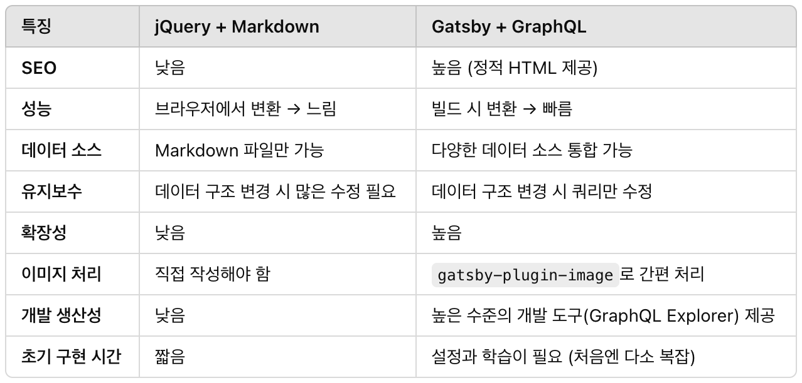
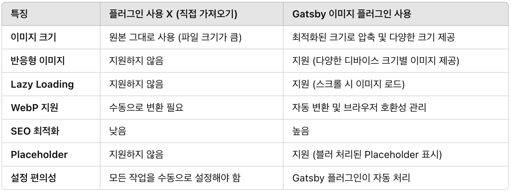

## 블로그 이제 Gatsby.js로 정착

Tistory, Velog에서 블로그를 조금씩 써보다 보니 블로그를 만들어보고 싶다는 생각이 들었습니다.

> Gatsby를 선택한 이유 3가지

`1. md 파일로 마크다운 글 작성 숙련도 올리기`<br/>
`2. 내 글을 타사 플랫폼 DB가 아닌 내가 소유하고 있음`<br/>
`3. 블로그에 하나씩 붙여보고 싶은 기능 추가해 보기`<br/><br/>
이전부터 마크다운 파일에 글을 능숙하게 써보고 싶었고, 추후에 더 큰 블로그로 마이그레이션도 해보고 싶었습니다.

## Gatsby로 블로그를 만들어보며 배운 점 3가지

### SSG 사용하보며, GraphQL 맛보기

Gatsby는 SSG (Static Site Generation, 정적 사이트 생성)입니다. 빌드 시점에 HTML이 모두 생성되어 있기 때문에,
빌드 시점에 사이트 내부에 사용될 모든 내용을 미리 만들어 두어도 되는 블로그에는 최적화된 방법입니다.

때문에, 빌드 시점에 모든 내용이 생성되기 때문에 API 요청이나 동적인 요소로 안에 데이터값을 바꾸긴 어렵습니다.

이제 빌드 시점에 블로그 글을 모두 가져와서 짜놓은 대로 보여준다는 건 알았는데 어떻게 이 글들을 가져올까요?<br/>
얼핏 생각해 보면 하드코딩해서 가져온 블로그 글을 그대로 매핑해두면 될 거 같은데, 블로그의 몸집이 커지고 확장성을 고려했을때 많은 차이가 있었습니다.


<span class="img-description">_(GraphQL은 데이터 요청(query), 수정(mutation), 구독(subscription)을 지원하지만, Gatsby에서는 “쿼리(query)” 만 사용합니다.)_</span>

이렇기에 graphQL을 사용해 content에 담아둔 게시물들을 query 해오는 게 어려가지 측면에서 유리하다는 걸 알았으니
graphQL 맛만 봐보겠습니다.

#### Gatsby 플러그인으로 데이터 소스 통합해 graphQL 스키마로 변환

**플러그인 설정**

<!--  -->

```javascript
plugins: [
  {
    resolve: `gatsby-source-filesystem`,
    options: {
      name: `images`,
      path: `${__dirname}/src/images`,
    },
  },
]
```

**데이터 쿼리**

<!--  -->

```javascript
query {
      allFile {
        edges {
          node {
            relativePath
            extension
            size
          }
        }
      }
    }

```

보기에 낯설어보이지만 저장해둔 파일을 플러그인으로 쉽게 가져오는 것입니다.

#### 마크다운 파일을 HTML로 변환

**플러그인 설정**

<!--  -->

```javascript
plugins: [
  `gatsby-transformer-remark`,
  {
    resolve: `gatsby-source-filesystem`,
    options: {
      name: `blog`,
      path: `${__dirname}/content/blog/`,
    },
  },
],
```

**데이터 쿼리**

<!-- 
 -->

```javascript
query {
 allMarkdownRemark {
   edges {
     node {
       frontmatter {
         title
         date
       }
       excerpt
     }
   }
 }
}
```

마크다운으로 쓴 블로그 글을 html로 변환해야 컴포넌트에서 자연스럽게 보여주겠죠?
이렇게 Gatsby 플러그인과 graphQL이 없다면… 꽤 멀리 돌아가야 된답니다.
예를 들면, “unified” 같은 라이브러리를 별도로 사용법을 익혀 적용해야 하는 수고스러움 같은 것이죠

이외에도 필터링, 정렬, 페이징을 지원합니다.

### Gastby에서 제공하는 Plugin으로 편하게 개발하기 (TOC, 이미지 최적화)

앞서 사용했던 플러그인에는 종류가 많습니다. 3282개나 있네요.<br />
_[Gatsby Plugin 보러가기](https://www.gatsbyjs.com/plugin "플러그인 링크")_

#### gatsby-remark-table-of-contents

저는 블로그를 만들게 된다면 상세 블로그 글에 TOC(table of contents)를 꼭 넣고 싶었습니다.


<!-- 
 -->

```javascript
    {
     resolve: `gatsby-remark-table-of-contents`,
     options: {
       // 설정 옵션
       exclude: "Table of Contents", // TOC에서 제외할 헤딩
       tight: true,
       ordered: true,
       fromHeading: 1, // 최소 헤딩 레벨
       toHeading: 6, // 최대 헤딩 레벨
     },
   },
```

이 또한 수많은 플러그인 중에 하나로 지원되고 있습니다.
마크다운 파일에서 h1, h2, h3와 같은 문단의 시작 부분만 추려서 전달해 줍니다.
_(물론 실제로 사용되는 TOC처럼 스크롤 할 때 색깔이나 모션을 주는 건 직접 해야 합니다.)_

#### gatsby-plugin-image

빌드 시 완성되는 웹사이트이다 보니 이미지도 static 폴더에 저장해두거나 외부 url을 사용해야겠죠?
gatsby에서는 이미지 최적화도 플러그인으로 지원합니다.

실제로 내가 직접 이미지를 넣어서 불러온 뒤 보여주는 것과 어떤 차이가 있을까요?



이미지 크기와 반응형 이미지를 직접 크기 조절하며 보기 좋게 넣어본 경험이 있다면, 이 플러그인이 제공하는 기능이 얼마나 좋은 건지 알 수 있습니다.

### Pages -> index.js 는 필요없다. Gatsby-node.js에서 만들어주는 페이지

이건 제가 삽질했던 부분 중 하나입니다. 기억으로는 반나절 정도 헤맸었는데, 요점만 말하자면 처음 웹사이트에 도착하면 마주하는 가장 기본 페이지인 ‘/‘경로에서 보여주는 내용들을 gatsby에서 제공하는 templates에서 만들어 보여주고 싶었지만, 작업한 내용들이 ‘/‘경로에서 보이지 않는 문제였습니다.

<!-- 
 -->

```javascript
createPage({
  path: "/",
  component: blogHome,
})
```

_(gatsby-node에서 만드는 ‘/‘경로 페이지)_

Gatsby는 파일 기반 라우팅과 createPage 기반 라우팅이 같은 경로에서 충돌하는 것을 방지되도록 설계되어 있습니다.

pages 안에 있는 index.js 페이지에서 ‘/‘경로로 먼저 매핑되기 때문에 보이지 않았었는데
파일 기반 라우팅이 우선 적용되기 때문에, ‘/‘ 경로 페이지를 별도로 작업할 일이 있다면 pages/index.js는 제거해야 합니다.

알고 보면 당연하지만, pages/index.js와 같이 기반이 되는 파일들을 지워본다는 생각을 해보지 못한 터라 삽질했네요.

### 마무리

요약하자면 Gatsby는 React 기반의 정적 사이트 생성기입니다.<br />
블로그 이외에도 정적 콘텐츠와 빠른 성능이 필요한 프로젝트에 유용하게 쓰일 수 있습니다.

오늘 포스팅 이외에도 블로그 업그레이드를 하면서 찾게 된 꿀팁 같은 걸 다음 기회에 또 나눠볼게요.
