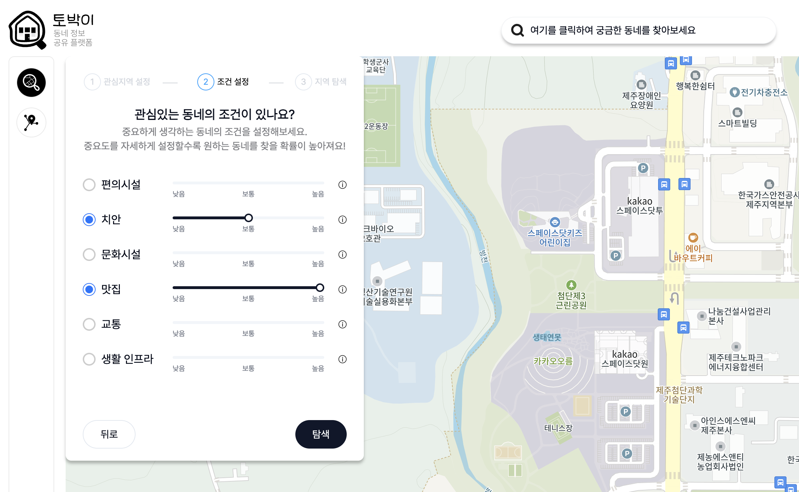

## 시작

프로젝트를 시작했고, 잘 마무리했습니다.<br />
이전에 팀 단위나 개인으로 수차례 프로젝트를 해보며 느낀 점은 시작은 설레고,
주 기능을 만들 땐 긴장감과 탄력이 어우러져 흥미가 배가 되지만
결국 마무리가 늘 어렵습니다.

마무리가 어려운 이유는 상품화하는 단계가 지루하기도 하고, 책임감이 비교적 회사일보다 적어서라고 생각합니다.

이번 프로젝트는 [경기청년 갭이어 프로그램](https://gwff.kr/base/board/read?boardManagementNo=33&boardNo=6851&searchCategory=&page=1&searchType=&searchWord=&menuLevel=2&menuNo=21 "링크")와 함께 했으며, IT업계에 종사하는 기획자 분과 개발자분 셋이서 진행했습니다!

## 뭘 만들었나요?

<!--  -->

공교롭게도 프로젝트 구성원 모두 지방에서 상경한 사람들입니다.
서울과 경기도는 항상 넓고 복잡하게만 느껴지는데요.

지인과 친구들과의 약속이 많은 사람들이 꼭 빼놓지 않고 생각하는 게 약속 장소입니다.
우스갯소리로 경기도에서는 어딜 가도 2시간이 걸린다는 말이 있습니다.

두 명 이상이 모일 때 공평하게 약속 장소를 정할 때 항상 오묘하게 서울 쪽으로 가게 되는 경험 한번씩들 있으시죠?

좌표값으로 정확히 계산된 중간지점이 있다면 설득력이 높아지지 않을까요?
그래서 나와 친구가 만날 때 가운데 지점을 좌표로 계산해 사용자가 지정한 카테고리별로 주위 맛집, 카페, 문화시설을 추천하는 서비스를 만들었습니다.


<span class="img-description">_(최대 5명의 동네 선택)_</span>


<span class="img-description">_(장소 카테고리 선택)_</span>


<span class="img-description">_(원하는 장소 클릭시 지도표시)_</span>

### 기능, 설명

초기에 아이디어 회의 때 구상했던 기능은 "중간 지점 찾기"입니다. 서로의 시작 지점과 카테고리(카페, 음식점 등)를 Form으로 설정하면 중간지점과 관련된 리스트가 생기고 각 장소를 클릭하면 지도에 표시됩니다.

이외에도 공공 API를 사용해 내 동네 검색도 구현하기로 했습니다.
대한민국 법정동 정보를 가져와 내가 사는 동네를 표시해 주는 것인데,
이건 추후에 "동네 추천"기능을 위한 빌드업이기도 했습니다.

#### 지도 API

초기에 카카오 지도와 네이버 지도 중에 고민했었습니다.


<span class="img-description">_(신규 서비스라면 사용자가 적어 과금 될 확률이 낮습니다.)_</span>

카카오 지도로 선택하게 된 이유는 이전에 한번 사용해 봤기 때문에 익숙한 부분도 있었고, 선택할 당시에는 제공하는 기능이나 요금제가 더 여유롭다고 판단했습니다.

**지도 api 선택이 중요할까?**

단발성으로 짧게 끊나는 토이 프로젝트라면 상관이 없다고 생각합니다.<br />
그러나 창업이나 서비스 고도화 계획이 있다면 추후에 지도 API를 바꾸는 건 개발자 입장에서 굉장한 부담이라고 생각합니다.<br />
플랫폼별로 제공하는 지도 API의 규칙이 다르기에 신중해야 된다고 생각했습니다.

`1. 초과 요금 구조에 유리한 API 선택`<br/>
`2. 확장성과 성능이 더 좋은지`<br/>
`3. 기획한 서비스와 UI/UX의 통일성 고려`<br/><br/>

#### 동네 검색 (Polygon)


<span class="img-description">_(선택한 동네의 영역보기)_</span>

Polygon으로 동네 영역 표시는 카카오 지도 API에서 좌표값을 입력받고 그려주는 기능 있습니다.

도형의 형태를 가지고 있기 때문에 꼭짓점마다 좌표값이 필요합니다.

공공 API [브이월드](https://www.vworld.kr/ "링크")에서 Polygon 데이터를 제공받습니다.

#### 중간 지점 찾기

```javascript
const handleSubmit = async (e: any) => {
  e.preventDefault()

  try {
    // 모든 출발지 좌표를 가져옵니다.
    const startLocations = await Promise.all(
      startPoints.map((point: any) => getCoordinates(point.name, toast))
    )

    // 모든 출발지의 위도와 경도의 총합을 계산합니다.
    const midpoint: any = startLocations.reduce(
      (acc, location) => {
        acc.lat += location.lat
        acc.lng += location.lng
        return acc
      },
      { lat: 0, lng: 0 }
    )

    // 출발지 개수로 나누어 평균을 구합니다.
    midpoint.lat /= startLocations.length
    midpoint.lng /= startLocations.length

    setMidpoint(midpoint)

    await getAddress(midpoint, toast, setAddress)

    stepFlow.next()
  } catch (err) {
    console.log(err)
  }
}
```

<span class="img-description">_(중간좌표값 구하기)_</span>

`1. 출발지 주소에 대한 좌표값들을 가져온다.`<br/>
`2. 좌표값의 평균을 구한 뒤 중간지점 좌표값을 도출한다.`<br/>
`3. 중간지점 좌표값을 기준으로 장소 검색 API 사용`<br/><br/>

### 기능 더 붙여볼까?

프로젝트 기간 내 개발 기간은 2달 남짓이었습니다.<br/>
개발을 하면서 시간이 여유롭진 않았지만, 지방에서 수도권으로 이사를 오게 되면서 겪었던 고충에 대해 팀원들과 얘기하던 중 <br/>이사 가고 싶은 동네에 대한 정보를 알지 못해 답답했던 기억들이 공통적으로 있었습니다.

이사 가고 싶은 동네가 있는데, 치안과 상권, 문화시설 등을 파악하기란 쉽지 않습니다. <br/>모든 게 처음이고 서투른 사회 초년생들에게 도움이 되는 기능을 만들자는 기획자분의 제안을 받아 개발이 진행되었습니다.


<span class="img-description">_(가고싶은 동네 선택)_</span>


<span class="img-description">_(카테고리 설정)_</span>


<span class="img-description">_(결과 - API서버다운으로 figma로 대체)_</span>

## 프로젝트 완성 후기(회고)

두 달여간의 짧은(?) 프로젝트가 끝났습니다.
처음에 생각한 기능과 페이지, 반응형 웹, 동네 정보 API 및 DB 설계는 데드라인에 잘 맞췄습니다!

운영비로 구매한 도메인은 남아있지만 서버 관리와 가 2024년 12월부터 사용이 어렵기에 새로 추가한 "좋은 동네 찾기"기능과 배포된 프런트 서버도 운영이 어렵습니다. (그래서 테스트 서버에 배포해둠)

회의를 하면서 얘기했던 상품화는 아쉽게도 진행되지 못했습니다.
SNS 홍보와 고도화 및 디자인을 추가해 우리가 짧지만 열심히 만든 서비스를 알려보고자 했지만, 더 좋은 소스가 많기에 다음을 기약하기로 했습니다.

책임감있게 마무리해준 기획자님과 백엔드 개발자님 감사합니다.

개발하면서 배운점과 아쉬웠던 점이 있습니다.

`1. 외부 API나 소스 사용 시에는 많은 조사와 신중을 기하자`<br/>

- 지도 API를 조사함에 있어 미흡했습니다. 선택지가 적고 사람들이 많이 사용하는 것 위주로 선택의 폭을 줄여나갔는데, 우리 서비스와 잘 어울리는지와 추후 상품화 과정을 고려하지 못했습니다. 중요하지 않은 부분이라 생각했지만,
  이 사소한 선택 하나가 그동안 만든 소스코드 전체를 뒤집어야 되는 상황이 올 수도 있다고 생각했습니다. 초기 환경 세팅이 반이라는 말을 들은 적이 있는데
  다음에 비슷한 상황이 생긴다면, 신중하게 자료조사를 더 해볼 것 같습니다.<br/><br/>

  `2. Jira로 이슈 정리`<br/>

- Jira를 사용해서 이슈관리를 하는 것과 하지 않는 것에 대한 체감을 크게 하지 못했었습니다. 마지막 데드라인만 맞춰 면 되는 거 아니야?라는 생각을 많이 갖곤 했는데, 이슈를 만들고 이슈마다 소요시간을 설정하는 게 내가 개발하고 있는 흐름을 파악하기 좋고 규칙적이고 체계적으로 개발함에 도움이 많이 된다는 걸 몸으로 체감했습니다.

## 링크

사용해보고 싶다면

[동네 정보 공유 플랫폼 - 토박이](https://tobagi-dev.netlify.app/ "링크")

방문해주세요.

다음에 또 재밌는 프로젝트 불태워보고 회고로 돌아오겠습니다🔥🔥🔥
